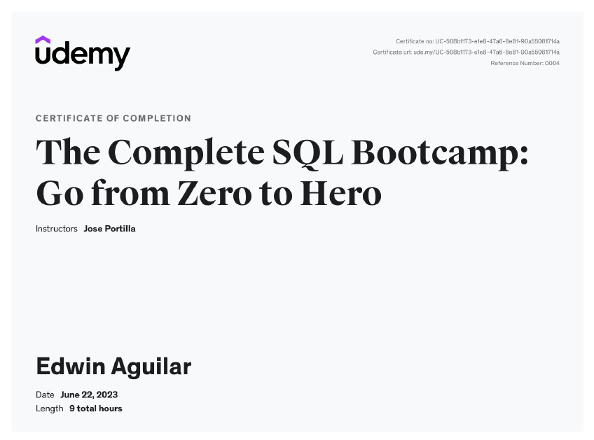

# Jose-Portilla-The-Complete-SQL-Bootcamp
SQL challenges &amp; assessment using PostgreSQL in pgAdmin from "The Complete SQL Bootcamp" Udemy course by Jose Portilla

My goal is to understand the fundamentals of SQL and integrate this tool with my current knowledge of Python and healthcare. 

